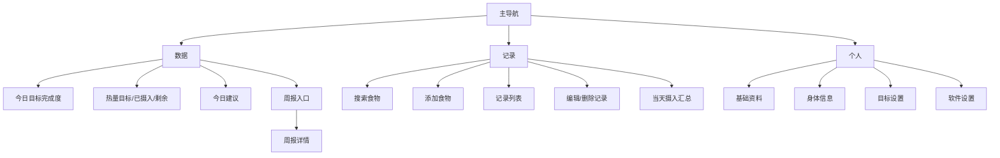
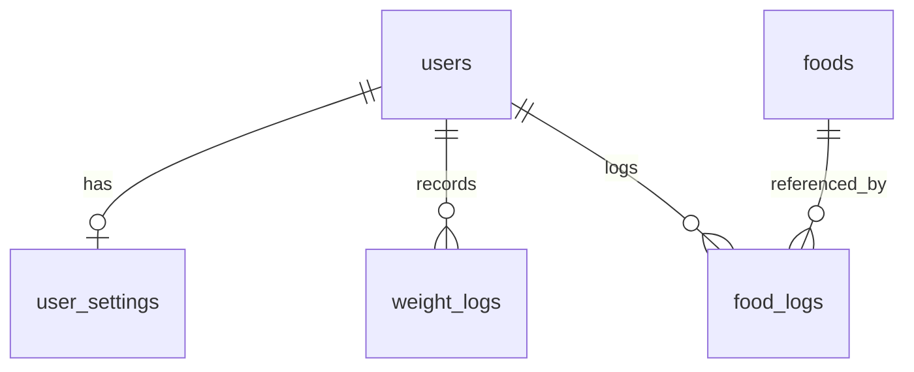

# 健身饮食管理 Web 应用 VibeCoding 开发文档

## 0. 文档用途

本文档用于直接交给 AI 编码工具或开发团队开始实现首版 MVP。目标是构建一款面向健身用户的饮食管理 Web 应用，重点完成：

- 设置增肌/减脂目标
- 记录每日食物摄入
- 自动计算热量和营养摄入
- 展示当日目标完成度
- 提供标准版周报复盘
- 支持个人资料、目标和软件设置管理

首版不追求复杂 AI、拍照识别、社交社区或教练后台，优先打通核心使用闭环。

---

# 1. 产品定位

## 1.1 一句话定位

一款面向有一定健身基础、会在增肌与减脂阶段切换的用户的 Web 饮食管理软件，帮助用户更容易坚持记录饮食、控制热量和营养摄入，并通过清晰反馈完成阶段目标。

## 1.2 目标用户

核心用户是有一定健身基础的用户：

- 理解热量、蛋白质、碳水、脂肪等基础概念
- 会在增肌期和减脂期之间切换
- 需要持续记录饮食并观察执行结果
- 需要比普通卡路里工具更强的目标感和反馈感

## 1.3 产品形态

产品定位为“指导陪伴型饮食管理工具”。

重点不是单纯记账，而是：

- 降低饮食记录门槛
- 让用户知道今天完成了多少
- 让用户知道还差多少
- 通过周报帮助用户复盘执行情况

## 1.4 首版平台

首版做 Web 网页端，采用响应式设计：

- 桌面端：适合看数据、复盘、管理设置
- 移动端：适合快速记录食物摄入

---

# 2. MVP 范围

## 2.1 MVP 必做

- 用户基础资料
- 当前目标设置：增肌 / 减脂
- 系统推荐每日热量和三大营养目标
- 用户可保存当前目标
- 平台食物库搜索
- 饮食记录新增、查看、编辑、删除
- 自动计算热量、蛋白质、碳水、脂肪
- 数据页展示今日目标完成度
- 数据页展示今日热量目标、已摄入、剩余
- 数据页展示今日建议
- 数据页提供周报入口
- 周报展示本周与上周对比、本周摘要、每日表现、建议
- 个人页展示和修改资料、目标、设置
- 体重记录，用于周报体重变化

## 2.2 P1 延后

- 自建食物完整管理页
- 最近吃过 / 常吃食物
- 复制历史餐
- 高级周报分析
- 连续记录强化展示
- 月报
- 数据导出
- 通知提醒高级配置

## 2.3 暂不做

- 拍照识别食物
- 复杂社交
- 教练/营养师后台
- 外部设备接入
- 复杂内容社区
- 完整品牌食品库

---

# 3. 信息架构

首版一级导航固定为三栏：

1. 数据
2. 记录
3. 个人

## 3.1 数据

用于看结果、看进度、看复盘。

包含：

- 今日目标完成度
- 今日热量目标 / 已摄入 / 剩余
- 今日建议 / 提醒
- 周报入口
- 周报详情页

## 3.2 记录

用于登记食物摄入。

包含：

- 当前日期
- 食物搜索入口
- 添加食物记录
- 已记录食物列表
- 编辑 / 删除记录
- 当天摄入汇总

## 3.3 个人

用于个人资料、目标和软件设置。

包含：

- 基础资料
- 身体信息
- 当前目标设置
- 软件设置

## 3.4 信息架构图



---

# 4. 页面原型结构

## 4.1 数据页

布局：响应式混合。

- 移动端：单列卡片流
- 桌面端：双列仪表盘

### 页面模块顺序

1. 今日目标完成度卡片
2. 热量目标卡片
3. 今日建议卡片
4. 周报入口卡片

### 字段

今日目标完成度卡片：

- `completion_rate`
- `goal_type`
- 今日状态：未达标 / 达标 / 超标

热量目标卡片：

- `daily_calorie_target`
- `consumed_calorie`
- `remaining_calorie`

今日建议卡片：

- `advice[]`

周报入口卡片：

- 本周日期范围
- 一句摘要
- 查看周报按钮

---

## 4.2 记录页

布局：添加优先。

### 页面模块顺序

1. 当前日期
2. 搜索 / 添加食物入口
3. 餐次筛选或选择：早餐、午餐、晚餐、加餐
4. 已记录食物列表
5. 当天摄入汇总

### 食物记录列表字段

每条记录展示：

- 食物名
- 餐次
- 重量 / 份数
- 热量
- 蛋白质
- 碳水
- 脂肪
- 编辑按钮
- 删除按钮

### 添加食物流程

1. 用户点击搜索/添加入口
2. 输入关键词搜索食物
3. 选择食物
4. 输入重量/份数
5. 选择餐次
6. 提交
7. 返回记录页并刷新当天记录和汇总

---

## 4.3 个人页

布局：分区卡片型。

### 页面模块

基础资料卡片：

- 昵称
- 性别
- 年龄

身体信息卡片：

- 身高
- 当前体重
- 记录今日体重入口

目标设置卡片：

- 当前目标类型：增肌 / 减脂
- 每日热量目标
- 蛋白目标
- 碳水目标
- 脂肪目标
- 重新计算推荐目标入口

软件设置卡片：

- 提醒开关
- 单位设置
- 主题设置

---

## 4.4 周报页

布局：对比优先。

### 页面模块顺序

1. 本周 vs 上周对比
2. 本周摘要
3. 每日表现
4. 下周建议

### 字段

本周 vs 上周对比：

- 本周完成度
- 上周完成度
- 完成度变化
- 本周体重变化
- 上周体重变化

每日表现：

- 日期
- 完成度
- 热量状态：低于目标 / 目标范围内 / 超出目标

---

# 5. 数据库设计

首版建议使用 5 张核心表：

- `users`
- `user_settings`
- `foods`
- `food_logs`
- `weight_logs`

周报首版不建表，动态聚合计算。

---

## 5.1 `users`

用途：保存用户基础资料和当前目标。

字段：

- `id`
- `nickname`
- `gender`
- `age`
- `height_cm`
- `current_weight_kg`
- `goal_type`
- `daily_calorie_target`
- `daily_protein_target_g`
- `daily_carb_target_g`
- `daily_fat_target_g`
- `created_at`
- `updated_at`

说明：

- `goal_type` 可选值：`muscle_gain`、`fat_loss`
- 首版只保留当前目标，不记录目标历史

---

## 5.2 `user_settings`

用途：保存用户软件设置。

字段：

- `id`
- `user_id`
- `unit_system`
- `reminder_enabled`
- `theme_mode`
- `default_home_tab`
- `created_at`
- `updated_at`

说明：

- `unit_system` 首版默认 `metric`
- `default_home_tab` 默认 `data`

---

## 5.3 `foods`

用途：保存平台食物库和后续用户自建食物。

字段：

- `id`
- `name`
- `category`
- `brand_name`
- `is_user_created`
- `owner_user_id`
- `base_unit`
- `base_amount`
- `calorie`
- `protein_g`
- `carb_g`
- `fat_g`
- `created_at`
- `updated_at`

说明：

- 平台食物：`is_user_created = false`，`owner_user_id = null`
- 用户自建食物：`is_user_created = true`，`owner_user_id = 当前用户 id`
- P0 可先只实现平台食物搜索，P1 完善自建食物

---

## 5.4 `food_logs`

用途：保存用户饮食记录明细。

字段：

- `id`
- `user_id`
- `food_id`
- `log_date`
- `meal_type`
- `amount`
- `unit`
- `calorie`
- `protein_g`
- `carb_g`
- `fat_g`
- `created_at`
- `updated_at`

说明：

- 不建餐次主表
- 通过 `log_date + meal_type` 分组
- `meal_type` 可选值：`breakfast`、`lunch`、`dinner`、`snack`
- `calorie`、`protein_g`、`carb_g`、`fat_g` 在记录时冗余存储，避免食物库修改影响历史数据

---

## 5.5 `weight_logs`

用途：保存体重记录。

字段：

- `id`
- `user_id`
- `weight_kg`
- `record_date`
- `note`
- `created_at`

说明：

- 首版只记录体重，不记录围度、体脂率
- 建议同一用户同一天只保留一条体重记录，重复提交时覆盖

---

## 5.6 ER 图



---

# 6. API 设计

## 6.1 通用返回结构

成功：

```json
{
  "code": 0,
  "message": "ok",
  "data": {}
}
```

失败：

```json
{
  "code": 4001,
  "message": "invalid parameter",
  "data": null
}
```

---

## 6.2 用户接口

### `GET /api/me`

用途：获取当前用户信息。

返回：

```json
{
  "id": "u_001",
  "nickname": "Alex",
  "gender": "male",
  "age": 26,
  "height_cm": 178,
  "current_weight_kg": 72.5,
  "goal_type": "muscle_gain",
  "daily_calorie_target": 2550,
  "daily_protein_target_g": 150,
  "daily_carb_target_g": 310,
  "daily_fat_target_g": 70,
  "profile_completed": true
}
```

### `PATCH /api/me`

用途：更新基础资料。

请求：

```json
{
  "nickname": "Alex",
  "gender": "male",
  "age": 27,
  "height_cm": 178,
  "current_weight_kg": 73
}
```

---

## 6.3 设置接口

### `GET /api/settings`

返回：

```json
{
  "unit_system": "metric",
  "reminder_enabled": true,
  "theme_mode": "light",
  "default_home_tab": "data"
}
```

### `PATCH /api/settings`

请求：

```json
{
  "reminder_enabled": false,
  "theme_mode": "dark"
}
```

---

## 6.4 目标接口

### `POST /api/goals/recalculate`

用途：重新计算推荐目标。

请求：

```json
{
  "gender": "male",
  "age": 26,
  "height_cm": 178,
  "current_weight_kg": 72.5,
  "goal_type": "fat_loss"
}
```

返回：

```json
{
  "recommended": {
    "daily_calorie_target": 2100,
    "daily_protein_target_g": 145,
    "daily_carb_target_g": 220,
    "daily_fat_target_g": 60
  }
}
```

### `PATCH /api/goals/current`

用途：保存当前目标。

请求：

```json
{
  "goal_type": "fat_loss",
  "daily_calorie_target": 2100,
  "daily_protein_target_g": 145,
  "daily_carb_target_g": 220,
  "daily_fat_target_g": 60
}
```

---

## 6.5 数据页接口

### `GET /api/dashboard/today?date=2026-05-15`

用途：获取数据页今日聚合数据。

返回：

```json
{
  "date": "2026-05-15",
  "goal_type": "fat_loss",
  "completion_rate": 68,
  "calories": {
    "target": 2100,
    "consumed": 1420,
    "remaining": 680
  },
  "macros": {
    "protein": {
      "target": 145,
      "consumed": 92,
      "remaining": 53
    },
    "carb": {
      "target": 220,
      "consumed": 130,
      "remaining": 90
    },
    "fat": {
      "target": 60,
      "consumed": 42,
      "remaining": 18
    }
  },
  "advice": [
    "今日蛋白质摄入偏低",
    "晚餐建议优先补蛋白"
  ],
  "weekly_report_entry": {
    "week_start": "2026-05-12",
    "week_end": "2026-05-18",
    "summary": "本周执行稳定，体重下降 0.4kg"
  }
}
```

---

## 6.6 周报接口

### `GET /api/reports/weekly?week_start=2026-05-12`

返回：

```json
{
  "week_start": "2026-05-12",
  "week_end": "2026-05-18",
  "comparison": {
    "current_week_completion_rate": 74,
    "previous_week_completion_rate": 68,
    "completion_rate_diff": 6,
    "current_week_weight_change_kg": -0.4,
    "previous_week_weight_change_kg": -0.1
  },
  "summary": {
    "title": "本周执行优于上周",
    "text": "整体热量控制较稳定，但蛋白摄入仍有提升空间。"
  },
  "daily_breakdown": [
    {
      "date": "2026-05-12",
      "completion_rate": 80,
      "calorie_status": "within_target"
    }
  ],
  "advice": [
    "优先提升早餐蛋白质摄入",
    "控制周末加餐热量"
  ]
}
```

---

## 6.7 饮食记录接口

### `GET /api/food-logs?date=2026-05-15`

返回：

```json
{
  "date": "2026-05-15",
  "items": [
    {
      "id": "log_001",
      "meal_type": "breakfast",
      "food_id": "food_001",
      "food_name": "燕麦",
      "amount": 80,
      "unit": "g",
      "calorie": 300,
      "protein_g": 10,
      "carb_g": 52,
      "fat_g": 5
    }
  ],
  "totals": {
    "calorie": 1420,
    "protein_g": 92,
    "carb_g": 130,
    "fat_g": 42
  }
}
```

### `POST /api/food-logs`

请求：

```json
{
  "date": "2026-05-15",
  "meal_type": "dinner",
  "food_id": "food_045",
  "amount": 200,
  "unit": "g"
}
```

服务端行为：

- 根据 `food_id` 读取食物基础营养数据
- 根据 `amount` 自动计算热量和营养值
- 将计算结果冗余写入 `food_logs`

### `PATCH /api/food-logs/:id`

请求：

```json
{
  "amount": 250,
  "unit": "g",
  "meal_type": "dinner"
}
```

### `DELETE /api/food-logs/:id`

返回：

```json
{
  "success": true
}
```

---

## 6.8 食物库接口

### `GET /api/foods?keyword=鸡胸&page=1&page_size=20&source=all`

返回：

```json
{
  "items": [
    {
      "id": "food_023",
      "name": "鸡胸肉",
      "base_unit": "g",
      "base_amount": 100,
      "calorie": 165,
      "protein_g": 31,
      "carb_g": 0,
      "fat_g": 3.6,
      "is_user_created": false
    }
  ]
}
```

### `GET /api/foods/:id`

用途：查看食物详情。

### `POST /api/foods`

P1：创建用户自建食物。

---

## 6.9 体重记录接口

### `GET /api/weight-logs?start_date=2026-05-12&end_date=2026-05-18`

用途：获取体重记录。

### `POST /api/weight-logs`

请求：

```json
{
  "record_date": "2026-05-15",
  "weight_kg": 72.5,
  "note": ""
}
```

### `PATCH /api/weight-logs/:id`

P1 可做。

### `DELETE /api/weight-logs/:id`

P1 可做。

---

# 7. 前端任务拆解

## FE-01 项目基础搭建

- 初始化 Web 项目
- 配置路由
- 配置全局布局
- 配置 API 请求层
- 配置基础状态管理
- 配置响应式规则

验收：项目可启动，存在 `数据 / 记录 / 个人` 三个主入口。

## FE-02 主导航与整体布局

- 实现三栏主导航
- 默认进入 `数据` 页
- 移动端适配底部导航或卡片入口

验收：三栏可正常切换，刷新后路由正常。

## FE-03 数据页

对接：`GET /api/dashboard/today`

实现：

- 今日目标完成度
- 热量目标 / 已摄入 / 剩余
- 今日建议
- 周报入口

## FE-04 周报页

对接：`GET /api/reports/weekly`

实现：

- 本周 vs 上周对比
- 本周摘要
- 每日表现
- 下周建议

## FE-05 记录页

对接：

- `GET /api/food-logs`
- `POST /api/food-logs`
- `PATCH /api/food-logs/:id`
- `DELETE /api/food-logs/:id`

实现：

- 当前日期
- 搜索/添加食物入口
- 已记录食物列表
- 编辑/删除
- 当天汇总

## FE-06 食物搜索与添加弹层

对接：

- `GET /api/foods`
- `GET /api/foods/:id`
- `POST /api/food-logs`

实现：

- 搜索食物
- 选择食物
- 输入重量
- 选择餐次
- 提交记录

## FE-07 个人页

对接：

- `GET /api/me`
- `PATCH /api/me`
- `GET /api/settings`
- `PATCH /api/settings`

实现：

- 基础资料卡片
- 身体信息卡片
- 目标设置卡片
- 软件设置卡片

## FE-08 目标设置流程

对接：

- `POST /api/goals/recalculate`
- `PATCH /api/goals/current`

实现：

- 选择增肌/减脂
- 修改基础数据
- 重新计算推荐目标
- 保存目标

## FE-09 体重记录入口

对接：

- `GET /api/weight-logs`
- `POST /api/weight-logs`

实现：

- 输入今日体重
- 保存体重记录
- 周报可读取体重变化

---

# 8. 后端任务拆解

## BE-01 项目基础搭建

- 初始化后端项目
- 配置路由
- 配置数据库连接
- 配置统一返回结构
- 配置错误处理
- 配置基础认证中间件

## BE-02 用户接口

接口：

- `GET /api/me`
- `PATCH /api/me`

要求：支持读取和修改用户基础资料、身体数据、当前目标。

## BE-03 设置接口

接口：

- `GET /api/settings`
- `PATCH /api/settings`

要求：新用户自动生成默认设置。

## BE-04 目标接口

接口：

- `POST /api/goals/recalculate`
- `PATCH /api/goals/current`

要求：

- 根据基础资料计算推荐目标
- 保存当前目标
- 不记录目标历史

## BE-05 食物库接口

接口：

- `GET /api/foods`
- `GET /api/foods/:id`

要求：

- 支持关键词搜索
- 返回食物营养字段
- P0 可只支持平台食物

## BE-06 饮食记录接口

接口：

- `GET /api/food-logs`
- `POST /api/food-logs`
- `PATCH /api/food-logs/:id`
- `DELETE /api/food-logs/:id`

要求：

- 按日期查询
- 新增和修改时自动计算营养
- 删除后汇总正确
- 返回当天汇总

## BE-07 数据页聚合接口

接口：

- `GET /api/dashboard/today`

要求：

- 聚合当前目标
- 聚合当日摄入
- 计算完成度
- 生成今日建议
- 返回周报入口摘要

## BE-08 周报接口

接口：

- `GET /api/reports/weekly`

要求：

- 计算本周完成度
- 计算上周完成度
- 计算体重变化
- 返回每日表现
- 返回建议

## BE-09 体重记录接口

接口：

- `GET /api/weight-logs`
- `POST /api/weight-logs`
- `PATCH /api/weight-logs/:id`
- `DELETE /api/weight-logs/:id`

P0 必做：

- `GET`
- `POST`

P1 再做：

- `PATCH`
- `DELETE`

---

# 9. 联调与里程碑

## 里程碑 1：基础框架可跑

包含：

- 前端三栏导航
- 后端服务
- 数据库连接
- `GET /api/me`

验收：用户能进入产品并看到基本页面结构。

## 里程碑 2：记录闭环

包含：

- 食物搜索
- 添加饮食记录
- 查看当天记录
- 当天汇总

验收：用户能完成“搜索食物 → 输入重量 → 添加记录 → 看到摄入汇总”。

## 里程碑 3：数据页闭环

包含：

- 当前目标
- 当日摄入聚合
- 今日完成度
- 今日建议

验收：新增饮食记录后，数据页目标完成度和剩余热量更新。

## 里程碑 4：个人设置闭环

包含：

- 修改个人资料
- 修改目标
- 重新计算推荐目标
- 修改软件设置

验收：用户能修改目标，数据页按照新目标重新计算。

## 里程碑 5：周报闭环

包含：

- 体重记录
- 周报聚合
- 本周 vs 上周对比
- 每日表现
- 建议文案

验收：周报能展示标准版内容，并能从数据页进入。

---

# 10. 推荐开发顺序

## 第 1 阶段：最小主链路

优先实现：

1. 数据库：`users`、`foods`、`food_logs`
2. 后端：`GET /api/me`
3. 后端：`GET /api/foods`
4. 后端：`GET /api/food-logs`
5. 后端：`POST /api/food-logs`
6. 前端：三栏导航
7. 前端：记录页
8. 前端：食物搜索与添加

目标：用户能搜索食物并记录摄入。

## 第 2 阶段：数据反馈闭环

实现：

1. `GET /api/dashboard/today`
2. 数据页
3. 今日完成度
4. 今日建议
5. 饮食记录后刷新数据页

目标：用户记录后能看到目标完成变化。

## 第 3 阶段：个人与目标设置

实现：

1. `PATCH /api/me`
2. `GET /api/settings`
3. `PATCH /api/settings`
4. `POST /api/goals/recalculate`
5. `PATCH /api/goals/current`
6. 个人页
7. 目标设置流程

目标：用户能修改资料和目标。

## 第 4 阶段：周报

实现：

1. `weight_logs`
2. `GET /api/weight-logs`
3. `POST /api/weight-logs`
4. `GET /api/reports/weekly`
5. 周报页

目标：用户能查看标准版周报。

---

# 11. MVP 验收标准

MVP 完成时必须满足：

1. 用户能进入 Web 应用并看到 `数据 / 记录 / 个人` 三个主导航。
2. 用户能设置当前目标为增肌或减脂。
3. 用户能搜索食物。
4. 用户能登记一条食物摄入。
5. 系统能根据食物和重量自动计算热量、蛋白质、碳水、脂肪。
6. 用户能查看当天饮食记录。
7. 用户能编辑和删除饮食记录。
8. 数据页能展示今日目标完成度。
9. 数据页能展示热量目标、已摄入、剩余。
10. 数据页能展示今日建议。
11. 用户能在个人页修改基础资料、身体信息、目标和软件设置。
12. 用户能记录体重。
13. 用户能从数据页进入周报。
14. 周报能展示本周 vs 上周对比、每日表现和建议。
15. 桌面端和移动端都基本可用。

---

# 12. 给 AI 编码工具的执行提示

如果把本文档交给 AI 编码工具，建议这样下达任务：

```text
请根据本 Markdown 文档从零实现一个饮食管理 Web 应用 MVP。

优先顺序：
1. 建立前后端项目基础结构。
2. 建立数据库表：users、user_settings、foods、food_logs、weight_logs。
3. 实现食物搜索和饮食记录主链路。
4. 实现数据页今日完成度聚合。
5. 实现个人页与目标设置。
6. 实现体重记录和周报。

要求：
- 一级导航固定为：数据、记录、个人。
- 周报作为数据页二级入口。
- 目标设置归入个人页。
- 首版只保留当前目标，不做目标历史。
- 饮食记录只存 food_logs 明细，通过 meal_type 分组。
- 新增饮食记录时服务端必须冗余保存当时计算出的热量和营养值。
- 页面要响应式适配桌面端和移动端。
- 优先完成 MVP 闭环，不要主动扩展拍照识别、社交、教练后台等功能。
```